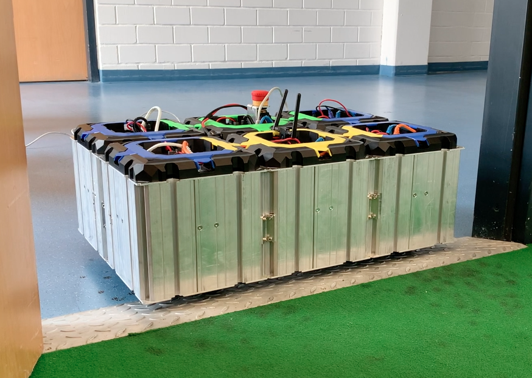

<div align="center">
  <h1 align="center">Motion Primitive for Robile (Freddy)</h1>
  <h3 align="center">
    Ramping behaviour of the robile platform using motion primitives.
  </h3>
</div>

The aim of the project is performing a controlled movement over the ramp using motion primitives for the robile platform robot. Based on previous semester SDP (WS2021) [Kelo 500 motion control](https://github.com/HBRS-SDP/ws21-kelo-500-motion-control) which uses force control.

[<div align="center"></div>](https://griffig.xyz)


<p align="center">
  You can find videos regarding the project <a href="https://drive.google.com/drive/folders/1rVMj4RdJPmCHwqase1NZHOby6o1TtAJh?usp=sharing">here</a>!
</p>


<p align="center">
  Project milestone deliverables can be found <a href="https://drive.google.com/drive/u/3/folders/1boct6apoQLtNgNKWaS_PBlGO9Hr4Donh">here</a>!
</p>


## Getting started

### Required library

 - Simple Open EtherCAT Master (SOEM) - communication between robot and the actuators. [SOEM](https://github.com/OpenEtherCATsociety/SOEM)
 - robif2b - robot control interface [robif2b](https://github.com/rosym-project/robif2b)
 - GSL - GNU Scientific Library [GSL](https://github.com/ampl/gsl)
 - WS21 SDP repository: Motion Control of the KELO 500 [Kelo 500 motion control](https://github.com/HBRS-SDP/ws21-kelo-500-motion-control)


#### [**TODO 1: how to create an install folder (where we keep all SOEM files)?]
#### [**TODO 2: instructions for WS21 ?]


### Building SOEM library 
```bash
git clone https://github.com/OpenEtherCATsociety/SOEM
```
Replace `STATIC` with `SHARED` on line 72 in CMakeList.txt, it should look like the code block below,
```
add_library(soem SHARED
  ${SOEM_SOURCES}
  ${OSAL_SOURCES}
  ${OSHW_SOURCES}
  ${OSHW_EXTRA_SOURCES})
target_link_libraries(soem ${OS_LIBS})
```

Continue building steps:
```
cd SOEM
mkdir build
cd build
cmake -DCMAKE_INSTALL_PREFIX=<path to install your folder>/install ..
make install
```

### Building robif2b library 
```bash
cd robif2b
mkdir build && cd build
cmake -DCMAKE_INSTALL_PREFIX=<path to install your folder>/install ..
cmake -DCMAKE_C_FLAGS="-I<path to install your folder>/install/include" -DENABLE_ETHERCAT=ON -DENABLE_KELO=ON ..
```

### How to get active wheels (slaves) indexes:
```bash
cd SOEM/build/test/linux/slaveinfo
sudo ./slaveinfo <your-ethernet-port-id>
```
[FYI: get the ethernet port id by running `ifconfig` or `ip a`]

## Running the code.

```bash
cd robif2b/build
make
sudo ./src/example/<name-of-the-executable-file>
```
## How to make any library as package:
```
TODO: instructions for making a library 
```

## User stories / TODO: 

- [x] Running previous semester SDP (Force distribution).
- [x] Orientation of wheel units to disired configuration.
- [x] Align the robot with ramp base.
- [ ] Implement ramp-up behaviour.
- [ ] Integrate sub-modules as a complete state machine.
